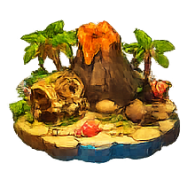
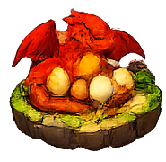
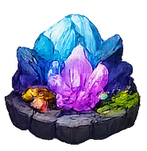
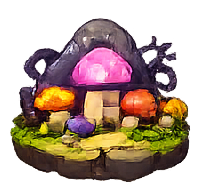
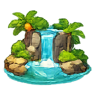
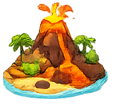
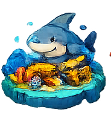
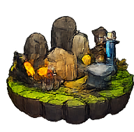
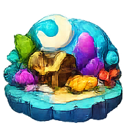
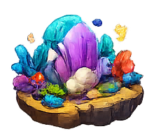

# 🏝️ 岛屿争夺战

一个基于 React + TypeScript 的回合制策略游戏。

## 游戏截图


## 游戏简介

在这片神秘的群岛中，玩家们争夺岛屿的控制权。通过购买装备、攻击敌方岛屿、占领领土，最终成为群岛的霸主！

每个玩家拥有初始血量（基地HP 200点），受到岛屿反击会损失基地血量。当玩家基地血量归零时将被淘汰。

## 岛屿展示

游戏中包含37个独特的岛屿，每个岛屿都有精美的图片：

| | | | |
|:---:|:---:|:---:|:---:|
|  |  |  |  |
| 爱斯基摩岛 | 彩虹岛 | 草屋岛 | 灯塔岛 |
|  |  |  |  |
| 火山岛 | 巨龙岛 | 骷髅岛 | 魔法岛 |
|  |  |  |  |
| 水晶岛 | 樱花岛 | UFO岛 | 珍宝岛 |

<details>
<summary>📦 查看所有岛屿</summary>

| | | | |
|:---:|:---:|:---:|:---:|
|  |  |  |  |
|  |  |  |  |
|  |  |  |  |
|  |  |  |  |
|  |  |  |  |
|  |  |  |  |
|  |  |  |  |
|  |  |  |  |
|  |  |  |  |
|  | | | |

</details>

## 核心玩法

- **回合制战斗**：每位玩家轮流行动，包含收入、商店、行动、结算四个阶段
- **血量系统**：玩家初始基地血量200点，受到反击会损失血量，基地HP归零则被淘汰
- **装备系统**：武器、防御、经济、消耗品四大类装备
- **反击机制**：岛屿受到攻击后会反击，玩家基地攻击力为50
- **漂流瓶抽奖**：每回合结束可获得漂流瓶，抽取随机装备
- **动态商店**：商品价格波动，稀有商品随机出现

## 快速开始

### 安装依赖

```bash
cd island-battle-game
npm install
```

### 启动开发服务器

```bash
npm run dev
```

访问 http://localhost:3000 开始游戏

### 在局域网中访问（如iPad）

```bash
npm run dev -- --host
```

然后在其他设备访问 `http://<虚拟机IP>:3000`

### 构建生产版本

```bash
npm run build
```

## 游戏规则

### 胜利条件

- 占领所有岛屿
- 其他玩家全部被淘汰（基地HP归零）
- 金币达到100,000

### 回合流程

1. **收入阶段**：根据拥有的岛屿数量获得金币
2. **商店阶段**：购买装备或刷新商品
3. **行动阶段**：攻击敌方岛屿或使用道具
4. **结算阶段**：获得漂流瓶，检查胜利条件

### 装备系统

- **武器**：攻击敌方岛屿，一次性使用
  - 普通武器：基础攻击力
  - 穿透武器：无视部分防御
  - 溅射武器：对相邻岛屿造成额外伤害
  - 暴击武器：必定暴击

- **防御**：增加防护罩HP或提供减伤
  - 减伤装备：减少受到的伤害百分比
  - 自修复：每回合自动恢复HP
  - 反伤：反弹部分伤害给攻击者
  - 隐形：一定回合内无法被攻击

- **经济**：增加金币收入或提供特殊效果
  - 永久加成：持续增加岛屿产出
  - 临时加成：几回合内增加产出
  - 特殊效果：额外攻击次数、免费刷新商店等

- **消耗品**：一次性使用的道具
  - 恢复道具：恢复防护罩HP

### 价格体系

基于锚点价值设计：
- 1攻击力 = 5金币
- 1点血量 = 5金币
- 1%减伤 = 10金币
- 稀有度系数：普通1.0x、稀有1.3x、史诗1.6x、传说2.0x

### 稀有度

- 普通 (60%)
- 稀有 (25%)
- 史诗 (12%)
- 传说 (3%)

## 技术栈

- React 18
- TypeScript 5
- Vite 5
- 无第三方状态管理库（使用 React Hooks）

## 项目结构

```
island-battle-game/
├── src/
│   ├── game/          # 游戏逻辑
│   ├── types/         # TypeScript 类型定义
│   ├── components/    # React 组件
│   ├── data/          # 游戏数据（装备、常量等）
│   ├── utils/         # 工具函数
│   └── main.tsx       # 应用入口
├── pic/               # 岛屿图片资源
├── public/            # 静态资源
├── index.html
├── package.json
└── vite.config.ts
```

## 功能特性

- ✅ 核心游戏逻辑
- ✅ 基础 UI 界面
- ✅ 装备系统（武器、防御、经济、消耗品）
- ✅ 漂流瓶抽奖
- ✅ 本地存档
- ✅ AI 对手
- ✅ 玩家血量系统（基地血量）
- ✅ 岛屿反击机制
- ✅ 真实岛屿图片

## 开发计划

- [ ] 多人对战（在线）
- [ ] 更多装备和特殊效果
- [ ] 音效和动画
- [ ] 移动端适配

## 许可证

MIT